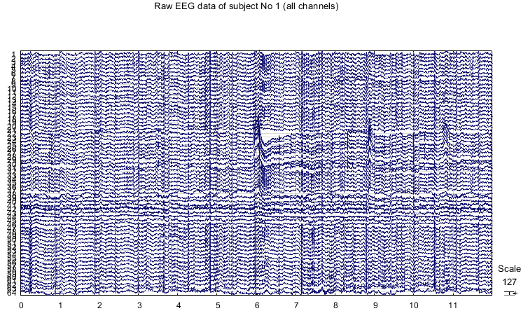
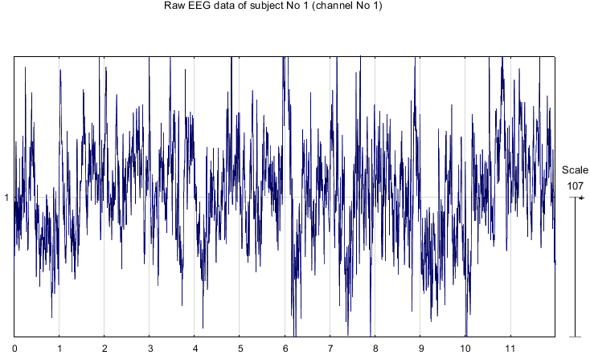
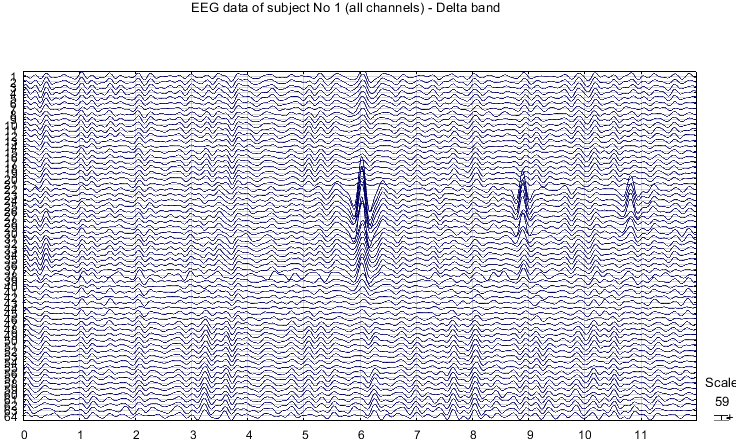
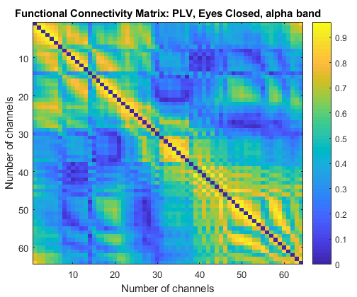
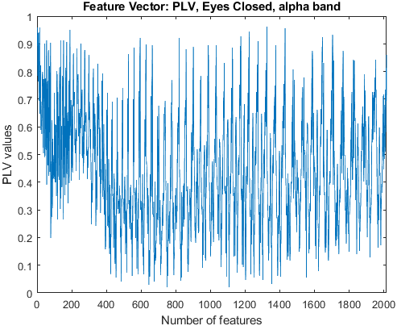
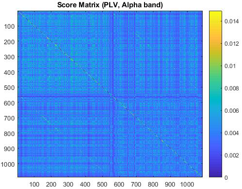
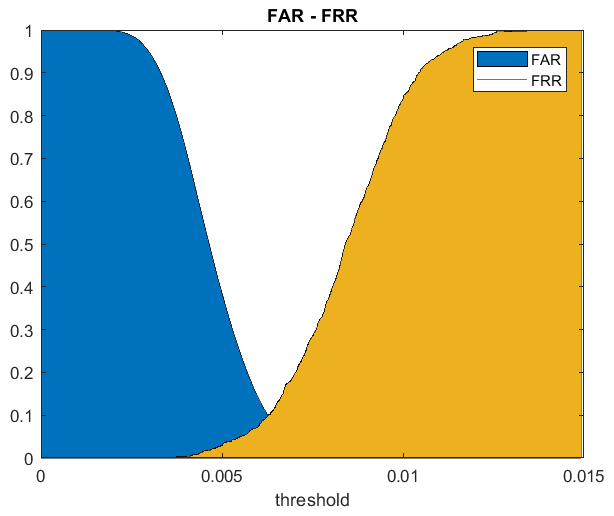
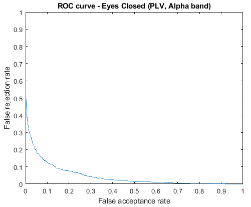
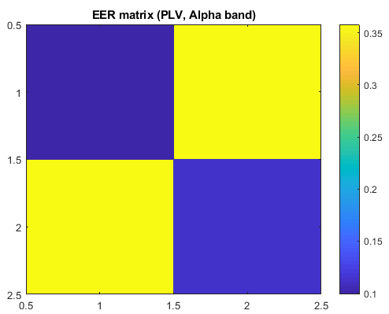

# BCI_Identification


Biometric identification using BCI systems.

This is a repository about my undergraduate thesis (University of Patras, Electrical and Computer Engineering).

You can find the pdf of the thesis here: https://nemertes.lis.upatras.gr/jspui/handle/10889/14472

The general structure of the code is the following:
1) Data Collection (EEG)
2) Preprocessing (spatial filtering - CAR - / frequency filtering - bandpass -)
3) Feature Extraction (compute various functional connectivity metrics)
4) Classification (compute a score via Euclidean distance, define a threshold vector for decision making and find EER matrix)

## Contents

- [Data](#data)
- [Prerequisites](#prerequisites)
- [Code](#code)
- [Project layout](#project-layout)
- [Examples (Images)](#examples-images)

## Data

To download the data, go here: https://physionet.org/content/eegmmidb/1.0.0/

You want the data from every subject (S001-S109), and the first two runs (R01 = baseline run eyes open and R02 = baseline run eyes closed).

Once the zip file is downloaded, you unzip it and put these files (only .edf, not .edf.event) in the same directory as the code, so you can read them properly.

## Prerequisites

To run this code you need Matlab 2017b version, or a newer one.

## Code

The code is written in Matlab and is in the "code" directory. In the main_program.m you will find everything you need with explanatory commenting.

Some information about the functions that are beeing used:

>import_eeg_data.m : Convert .edf (European Data Format) files to matrices.    [edfread.m]

>CAR.m : Apply CAR (Common Average Referencing) filter (spatial filter) to the raw EEG (ElectroEncephaloGraphy) data.

>eegfilt.m : Apply bandpass filter to seperate EEG data into specific bands.

Bands:
delta band = [1-4 Hz], theta band = [4-8 Hz], alpha band = [8-13 Hz], beta band = [13-30 Hz], gamma band = [30-45 Hz]

In line 75 of main_program.m you can choose a flag  = 0 if you want to apply this process in the spatial filtered data (CAR), or choose a flag = 1 if you want to apply this process in the raw EEG data.

>ConnectivityMatrix.m : Compute connectivity matrix for each subject, each epoch and each frequency band.    [orthogonalization.m]

Functional Connectivity (FC) Metrics:
1) PLV (Phase Locking Value)
2) PLI (Phase Lag Index)
3) COR (Pearson's Correlation Coefficient)
4) AEC (Amplitude Envelope Correlation)
5) AECc (AEC corrected version)
6) COH (Spectral Coherence)

>FeatureVector.m : Extract feature vectors from the upper triangular connectivity matrix

>CalcScoreMatrix.m : Calculate score matrix for each FC metric using the Euclidean distance.

>EERMatrix.m : Calculate EER (Equal Error Rate) matrix for each metric in each band. This function, also, returns the FAR (False Accept Rate) and FRR (False Rejection Rate) for each metric and each band.    [Genuine_Impostor_Scores.m and Calculate_FAR_FRR.m]

EER is the point of the ROC (Receiver Operating Characteristic) curve where FAR == FRR.

From line 676 and below there are some prints to see the results.

## Project layout

```
BCI_Identification/
├── code/
│   ├── main_program.m         Entry point: runs the full pipeline (cell-by-cell)
│   ├── import_eeg_data.m      Read .edf recordings into matrices
│   ├── edfread.m              European Data Format reader (helper)
│   ├── CAR.m                  Common Average Referencing (spatial filter)
│   ├── eegfilt.m              FIR bandpass filter (helper)
│   ├── eegplot.m              Multi-channel EEG viewer (helper)
│   ├── ConnectivityMatrix.m   Functional connectivity matrix per metric/band
│   ├── orthogonalization.m    Signal-leakage correction (used by AECc)
│   ├── FeatureVector.m        Upper-triangle of a matrix -> feature vector
│   ├── CalcScoreMatrix.m      Similarity scores via Euclidean distance
│   ├── EERMatrix.m            Equal Error Rate / AUC per metric and band
│   ├── Genuine_Impostor_Scores.m   Split scores into genuine vs impostor
│   └── Calculate_FAR_FRR.m    Sweep threshold -> FAR / FRR
├── docs/images/               README example figures
├── CITATION.cff               How to cite this work
├── LICENSE                    MIT
└── README.md
```

## Examples (Images)

1) Raw EEG data from all 64 channels from subject 1 during the baseline run with eyes open. The duration here is 12 seconds.



2) Zoom in to see the data from 1 channel.



3) After preprocessing, you can see the same data filtered in delta band [1-4 Hz].



4) Functional connectivity matrix for the PLV metric. It is from subject 1, in alpha band, during the baseline run with eyes closed.



5) Extracting the feature vector from the upper triangular matrix of the last photo.



6) Score matrix for PLV metric in alpha band. This includes scores for 5 epochs, 109 subjects and 2 tasks (eyes open, eyes closed).



7) Example of FAR and FRR values depending on the threshold value.



8) Example of a ROC curve.



9) Finally, example of an EER matrix. The value 0 is the best for EER.




